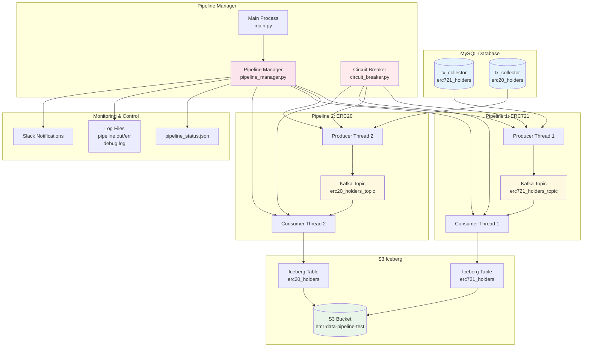
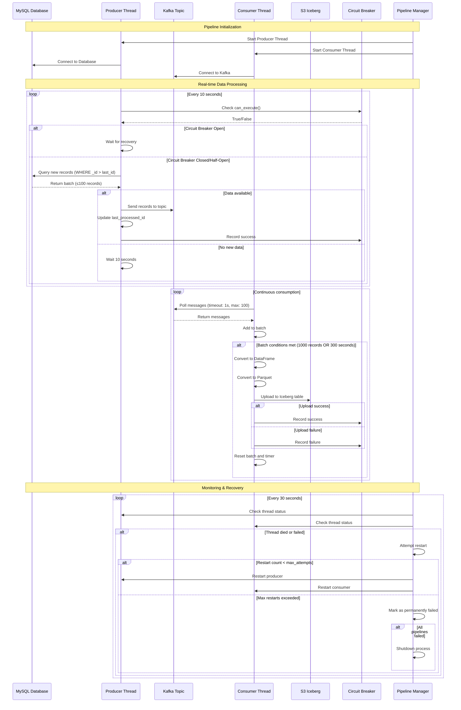
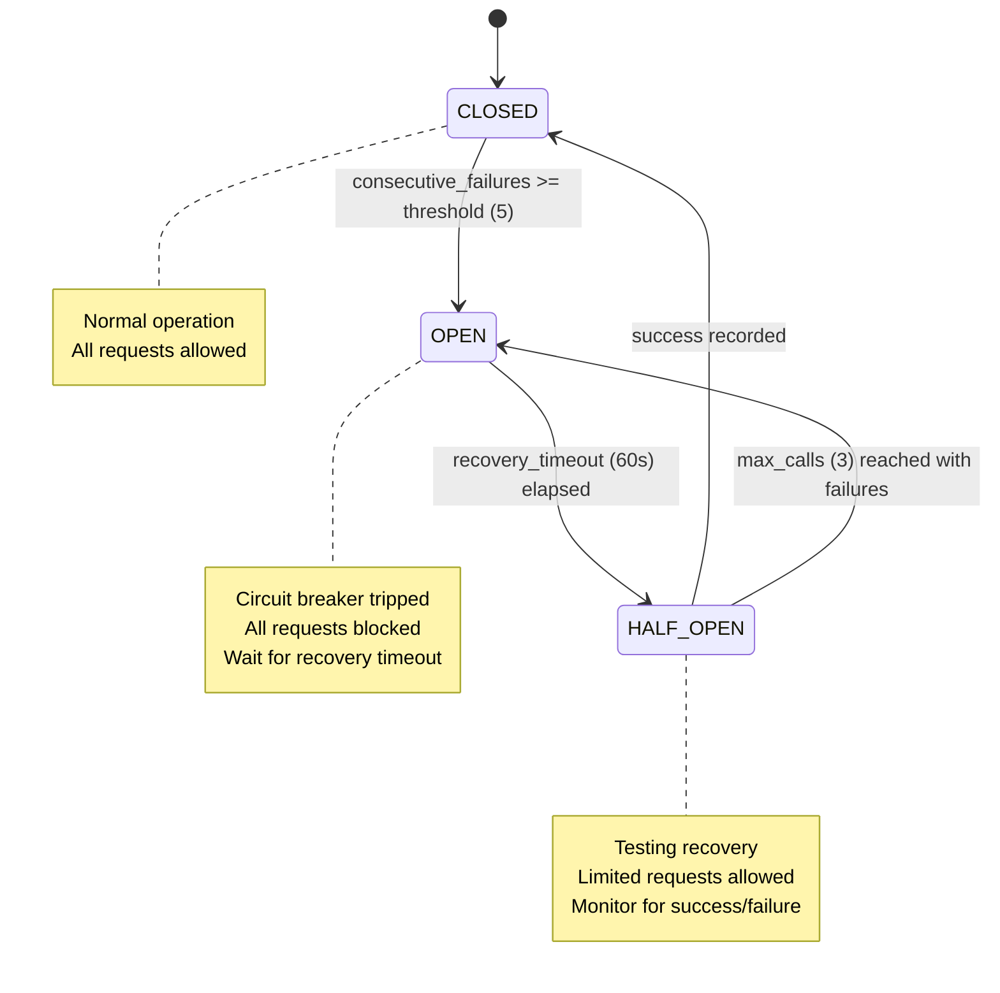
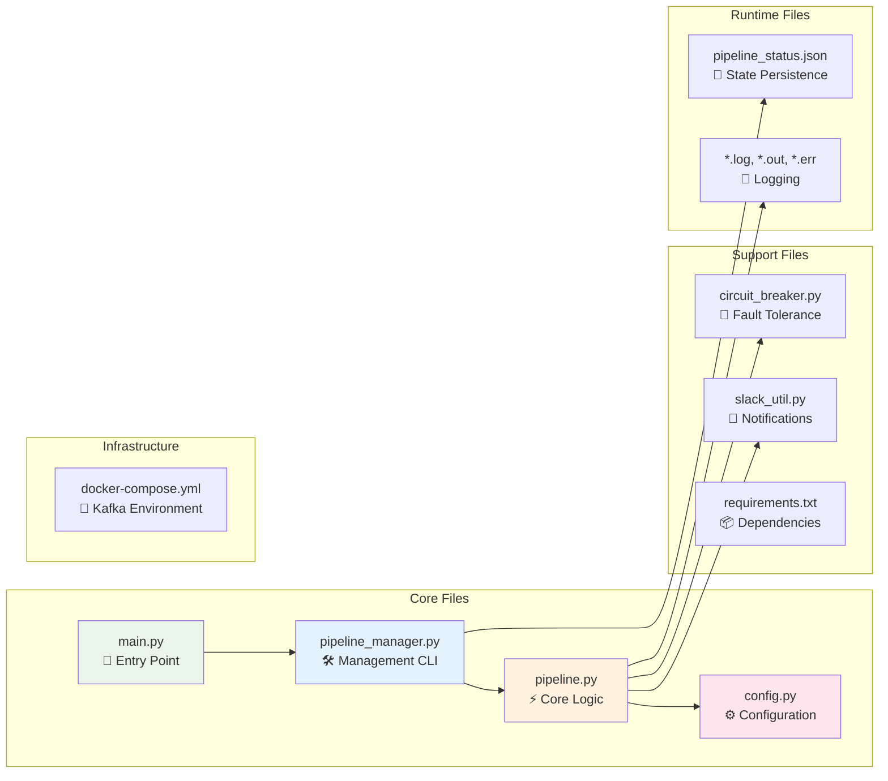
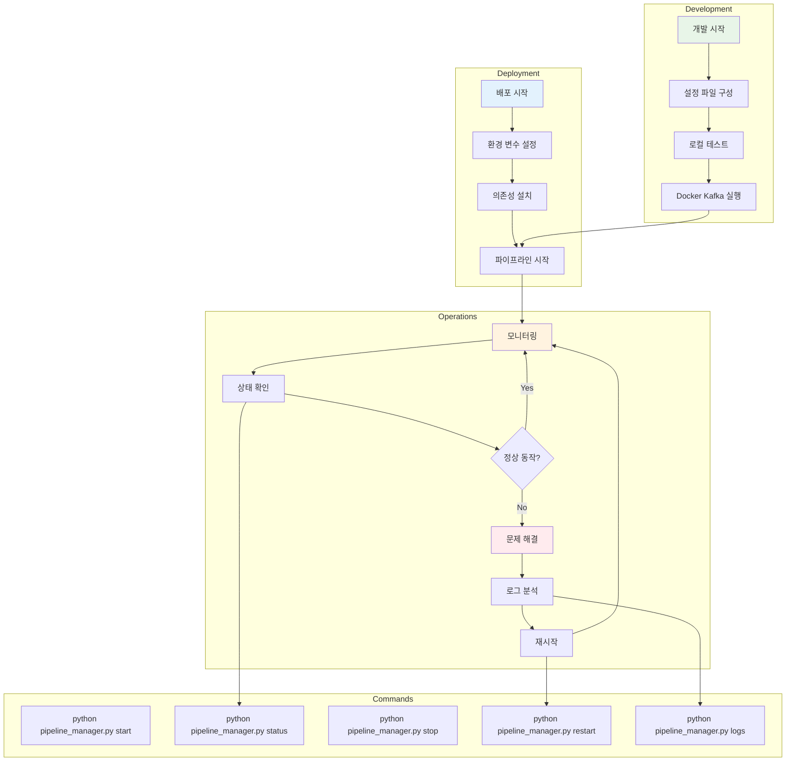

# MySQL → Kafka → Iceberg Data Pipeline Architecture

## 🏗️ 전체 시스템 아키텍처



## 🔄 파이프라인 상세 플로우

```mermaid
flowchart TD
    subgraph "Initialization"
        START[Start Pipeline Manager] --> LOAD_CONFIG[Load Configuration<br/>config.py]
        LOAD_CONFIG --> INIT_MANAGER[Initialize Pipeline Manager]
        INIT_MANAGER --> CREATE_PIPELINES[Create Pipeline Instances]
    end
    
    subgraph "Producer Flow (Per Pipeline)"
        PROD_START[Start Producer Thread] --> MYSQL_CONN[Connect to MySQL]
        MYSQL_CONN --> LOAD_STATUS[Load last_processed_id<br/>from pipeline_status.json]
        LOAD_STATUS --> POLL_LOOP{Poll Loop<br/>Every 10s}
        
        POLL_LOOP --> QUERY[SELECT * FROM table<br/>WHERE _id > last_processed_id<br/>LIMIT 100]
        QUERY --> CHECK_DATA{New Data?}
        
        CHECK_DATA -->|Yes| CB_CHECK{Circuit Breaker<br/>Can Execute?}
        CHECK_DATA -->|No| WAIT[Wait 10 seconds]
        WAIT --> POLL_LOOP
        
        CB_CHECK -->|Yes| SEND_KAFKA[Send to Kafka Topic]
        CB_CHECK -->|No| CB_WAIT[Circuit Breaker Wait]
        CB_WAIT --> POLL_LOOP
        
        SEND_KAFKA --> UPDATE_ID[Update last_processed_id]
        UPDATE_ID --> SAVE_STATUS[Save to pipeline_status.json]
        SAVE_STATUS --> POLL_LOOP
        
        SEND_KAFKA -->|Failure| RECORD_FAILURE[Record Circuit Breaker Failure]
        RECORD_FAILURE --> POLL_LOOP
    end
    
    subgraph "Consumer Flow (Per Pipeline)"
        CONS_START[Start Consumer Thread] --> KAFKA_CONN[Connect to Kafka]
        KAFKA_CONN --> INIT_BATCH[Initialize Batch<br/>message_batch = []]
        INIT_BATCH --> CONS_LOOP{Consumer Loop}
        
        CONS_LOOP --> POLL_KAFKA[Poll Kafka Messages<br/>timeout: 1s, max: 100]
        POLL_KAFKA --> CHECK_MSGS{Messages Available?}
        
        CHECK_MSGS -->|Yes| ADD_BATCH[Add to message_batch]
        CHECK_MSGS -->|No| CHECK_TIMEOUT{Batch Timeout?<br/>300 seconds}
        
        ADD_BATCH --> CHECK_BATCH_SIZE{Batch Size >= 1000<br/>or Timeout?}
        CHECK_BATCH_SIZE -->|Yes| PROCESS_BATCH[Process Batch]
        CHECK_BATCH_SIZE -->|No| CONS_LOOP
        
        CHECK_TIMEOUT -->|Yes & Not Empty| PROCESS_BATCH
        CHECK_TIMEOUT -->|No| CONS_LOOP
        
        PROCESS_BATCH --> CONVERT_DF[Convert to DataFrame]
        CONVERT_DF --> CONVERT_PARQUET[Convert to Parquet]
        CONVERT_PARQUET --> UPLOAD_S3[Upload to S3 Iceberg]
        UPLOAD_S3 --> RESET_BATCH[Reset Batch & Timer]
        RESET_BATCH --> CONS_LOOP
        
        UPLOAD_S3 -->|Success| CB_SUCCESS[Record Circuit Breaker Success]
        UPLOAD_S3 -->|Failure| CB_FAIL[Record Circuit Breaker Failure]
        CB_SUCCESS --> RESET_BATCH
        CB_FAIL --> RESET_BATCH
    end
    
    subgraph "Monitoring & Management"
        MONITOR[Monitor Thread<br/>Every 30s] --> CHECK_STATUS[Check Pipeline Status]
        CHECK_STATUS --> RESTART_CHECK{Need Restart?}
        RESTART_CHECK -->|Yes| AUTO_RESTART[Attempt Auto Restart]
        RESTART_CHECK -->|No| MONITOR
        
        AUTO_RESTART --> RESTART_COUNT{Restart Count<br/>< Max Attempts?}
        RESTART_COUNT -->|Yes| RESTART_PIPELINE[Restart Pipeline]
        RESTART_COUNT -->|No| MARK_FAILED[Mark as Permanently Failed]
        
        MARK_FAILED --> ALL_FAILED{All Pipelines<br/>Failed?}
        ALL_FAILED -->|Yes| SHUTDOWN[Shutdown Process]
        ALL_FAILED -->|No| MONITOR
        
        RESTART_PIPELINE --> MONITOR
    end
    
    style START fill:#e8f5e8
    style PROD_START fill:#e3f2fd
    style CONS_START fill:#fff3e0
    style MONITOR fill:#fce4ec
    style SHUTDOWN fill:#ffebee
```

## 📊 데이터 플로우 시퀀스



## 🔧 Circuit Breaker 상태 다이어그램



## 📁 파일 구조 및 역할



## 🚀 배포 및 운영 플로우



## 📊 성능 메트릭스

### 처리 성능
- **MySQL 폴링**: 10초 간격
- **배치 크기**: 100 레코드/배치 (MySQL → Kafka)
- **Kafka 배치**: 1000 레코드 또는 300초 (Kafka → S3)
- **동시 파이프라인**: 2개 (ERC721, ERC20)

### 안정성 메트릭스
- **Circuit Breaker 임계값**: 연속 5회 실패
- **복구 시간**: 60초
- **최대 재시작**: 10회/파이프라인
- **모니터링 간격**: 30초

### 저장소 구조
```
S3: emr-data-pipeline-test/
├── iceberg-warehouse/
│   ├── erc721_holders/
│   │   ├── metadata/
│   │   └── data/
│   └── erc20_holders/
│       ├── metadata/
│       └── data/
``` 